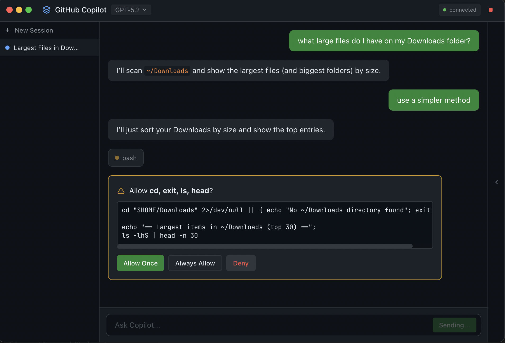

# Copilot Skins

<p align="center">
  
</p>

A beautiful native desktop GUI for GitHub Copilot, built with Electron and the [Copilot SDK](https://github.blog/changelog/2026-01-14-copilot-sdk-in-technical-preview/).



## Features

### Chat & Sessions
- 🎨 **Clean chat interface** - Modern dark theme matching GitHub's design
- 📑 **Multi-session tabs** - Work on multiple conversations simultaneously
- 💬 **Session persistence** - Sessions are saved and restored across app restarts
- 🏷️ **AI-generated titles** - Sessions automatically get descriptive names
- ⚡ **Streaming responses** - See answers as they're generated
- 📝 **Markdown rendering** - Rich formatting for responses (lists, code blocks, bold, etc.)

### Models
- 🤖 **Multiple models** - Switch between GPT-5.2, GPT-5 mini, Claude Sonnet 4.5, Claude Opus 4.5, and Gemini 3 Flash
- 💰 **Cost indicators** - See relative pricing for each model
- 💾 **Persistent settings** - Your model preference is saved per session

### Working Directory & Trust
- 📁 **Per-session working directory** - Each session can operate in a different folder
- 🔒 **Directory trust flow** - Prompted to trust folders before granting access (once/always/deny)
- 🔄 **Directory picker** - Change working directory via the session info panel

### Permissions & Security
- ✅ **Command approval** - Review and approve shell commands before execution
- 📋 **Per-executable tracking** - "Always allow" works per command (mkdir, ls, etc.)
- 📄 **File change approval** - Approve file writes with path visibility
- 🚫 **Out-of-scope protection** - Extra confirmation for reading files outside workspace
- 🔧 **Tool execution indicators** - See when tools are running

### UI
- 📊 **Session info panel** - Right sidebar shows working directory and always-allowed commands
- 📜 **Previous sessions** - Access and restore past conversations
- 🎯 **Auto-focus input** - Chat input is focused when switching sessions

## Prerequisites

- Node.js 18+
- GitHub Copilot subscription
- GitHub CLI authenticated (`gh auth login`)

## Installation

### Download (macOS)

**[⬇️ Download Copilot Skins for macOS (Apple Silicon)](https://github.com/idofrizler/copilot-ui/releases/latest/download/Copilot-Skins-1.0.0-arm64.dmg)**

Or visit the [Releases page](https://github.com/idofrizler/copilot-ui/releases) for all versions.

### Build from source

```bash
npm install
npm run dist
```

The built app will be in the `release/` folder.

> **Note:** pnpm may have memory issues with some Node.js versions. Use npm if you encounter problems.

## Development

```bash
npm run dev
```

## Build

```bash
npm run build
```

## How It Works

This app uses the official [GitHub Copilot SDK](https://www.npmjs.com/package/@github/copilot-sdk) to communicate directly with GitHub Copilot. It creates a native Electron window with a React-based chat interface.

The SDK uses your existing GitHub authentication (via `gh` CLI) to authenticate requests.

### Architecture

- **Multiple CopilotClients** - One client per unique working directory for proper cwd isolation
- **Session state** - Tracks model, cwd, and always-allowed executables per session
- **IPC bridge** - Secure communication between main process and renderer

## Tech Stack

- **Electron** - Native desktop app
- **React** - UI framework
- **TypeScript** - Type safety
- **Tailwind CSS** - Styling
- **Copilot SDK** - GitHub Copilot integration
- **electron-store** - Settings and session persistence
- **react-markdown** - Response formatting

## License

MIT
